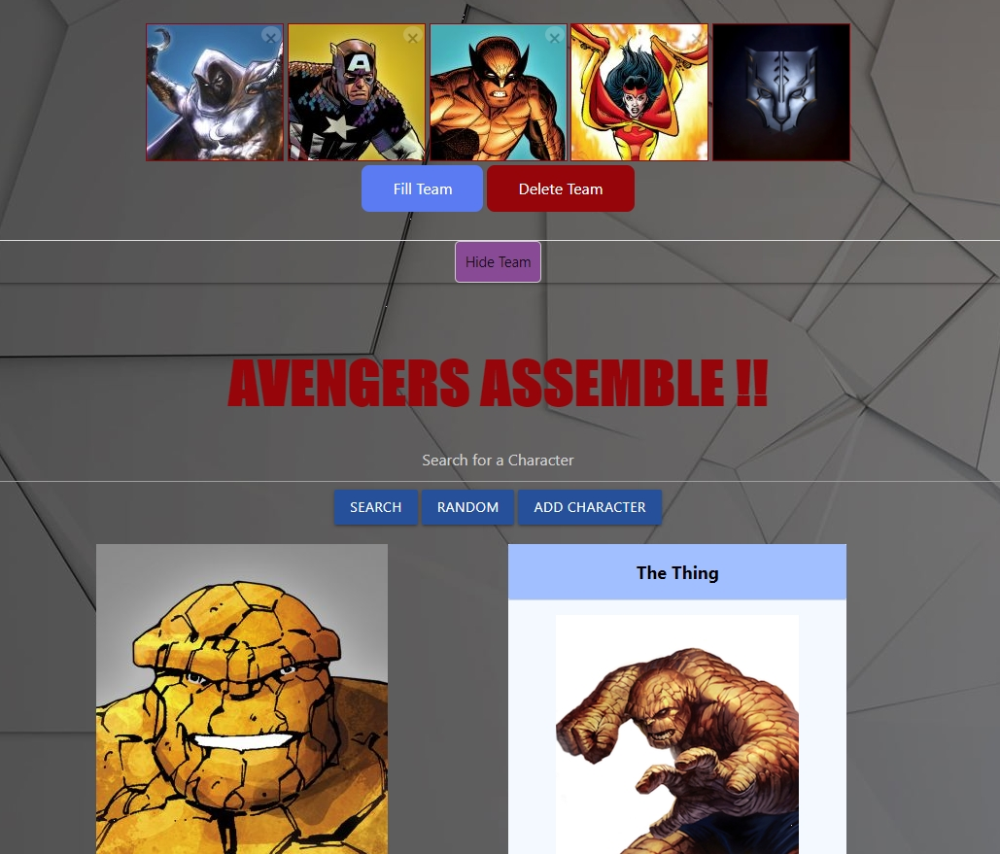
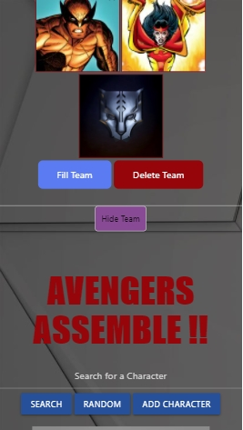

# Avengers Assemble

## About / Synopsis

* Allows users to research Marvel characters, discover new ones, and create a team with 5 characters.
* Status: Prototype

### Features

- Random button to display a randomly generated character
- Search feature to find a specific character using Marvel API
- Materialize Carousel component to find the character searched for
- Wikipedia article to give more information on selected character
- Add Character button to add character to your team
- Materialize Collapsible component to show or hide team choices 
- Fill team button to fill empty team spaces with randomly generated characters
- Individual character delete buttons
- Delete team button to remove all characters from team 
- Local storage to save team choices
- Reactive mobile display using Materialize Grid and CSS Media Queries

## Resources

- [Marvel API](https://developer.marvel.com/)
- [Wikipedia API](https://www.mediawiki.org/wiki/API:Main_page)
- [Materialize CSS Framework](https://materializecss.com/)
- [jQuery](https://jquery.com/)

## Contributing / Reporting issues

If you'd like to contribute, please fork the repository and use a feature branch. Pull requests are warmly welcome.

## Links

- Project homepage: https://jesseparent.github.io/avengersassembled/
- Repository: https://github.com/jesseparent/avengersassembled/
- Issue tracker: https://github.com/jesseparent/avengersassembled/issues/

## Screenshots
- Desktop screenshot of the final work:  

- Mobile screenshot of the final work: 

- Animated screenshot showing all functionality:  
